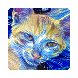
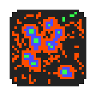
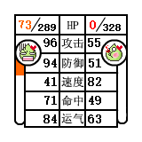

---

| ------------- | ------------- | ------------- |
|  | [名字竞技场](/zh/namerena/)   基于文本的对战游戏，战斗的过程由输入的名字决定，固定的输入有固定的对战结果 |
|  | [Hashdown](/zh/hashdown.html)   文本编码和压缩的工具，可以在有限的字符内储存更多的文本信息 |
|  | [深度熔合](/zh/deep-fuse/)   基于神经网络的图像合成软件 |
|  | [Virus细胞自动机](/zh/virus.html)   基于GLSL的4状态细胞自动机 |
|  | [MD5大作战](/zh/md5.html)   很久之前做的Flash小游戏，已经被新版游戏[名字竞技场](http://namerena.github.io/help/)取代 |