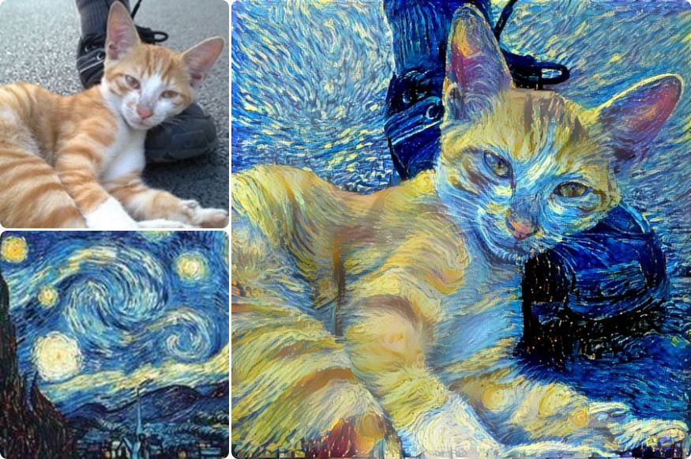

**深度熔合**是一款基于神经网络的智能图像合成软件。

输入一张内容图和一张样式图，就能将两个图像混合成一个几乎完美的画作。

图像合成网站[Ostagram](http://ostagram.ru/static_pages/lenta?last_days=1000&locale=en)的后台使用的是和深度熔合相同的引擎，核心算法都基于[Neural-Style项目](https://github.com/jcjohnson/neural-style)。

### 安装

深度熔合目前只支持Linux系统，

Windows10用户可以[通过Windows自带的Linux子系统安装](winbash.html)

其他用户可以使用[预装深度熔合的VirtualBox镜像](virtualbox.html)

如果熟悉Ubuntu的话也可以[直接在Ubunut安装](install.html)

