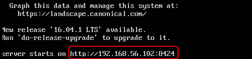
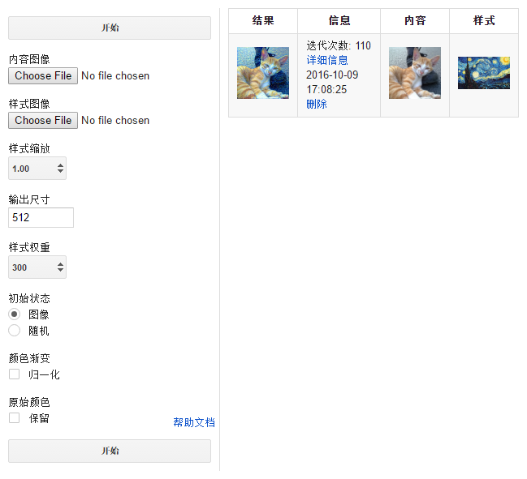

深度熔合服务器打开后，命令行终端会出现服务器的地址

将命令行里显示的地址输入浏览器就能进入网页界面

### 网页界面参数说明

#### 内容图像 

原始内容图像，合成时会以这张图的形状，明暗作为基准。

#### 样式图像

样式图像，合成时会从中选取各类样式和材质填充到内容图像中。
 
#### 样式缩放

相当于样式图像在合成之前的预处理，可以放大或缩小。

#### 输出尺寸

输出图像的长宽比例与内容图一致，输出尺寸定义了长宽两者中的最大值。

#### 样式权重

样式权重越大，则原始图像的形状保留的越少。

#### 初始状态

初始状态为`图像`更容易快速得到合适的结果，而初始为`随机`可能需要额外的几百次迭代才能达到相同效果。

但初始状态随机能带来更多的可能性，同时会让样式图的特征更充分的表达在输出图像里。

#### 颜色渐变

根据原站的文档，如果选中`归一化`，更适合一些抽象样式的合成。

#### 原始颜色

如果选中`保留`，将尽可能保留内容图的颜色。

### 输出列表说明

#### 结果

输出结果图，每5次迭代结果图刷新一次。会随着时间逐渐改善。

点击结果图可以查看大图。

#### 信息

任务开始时间和迭代次数，最初的迭代需要的时间稍长，之后每次迭代需要几秒钟（取决于CPU），到1000次迭代自动停止。

点击`详细信息`可以进入任务详情的页面，包括生成图像的历史记录，和创建时使用的参数

点击`删除`会将选中的这条记录删除。

**通常要达到理想的合成效果至少需要200次迭代，要耐心等待**。

#### 内容 和 样式

最初输入的内容图和样式图