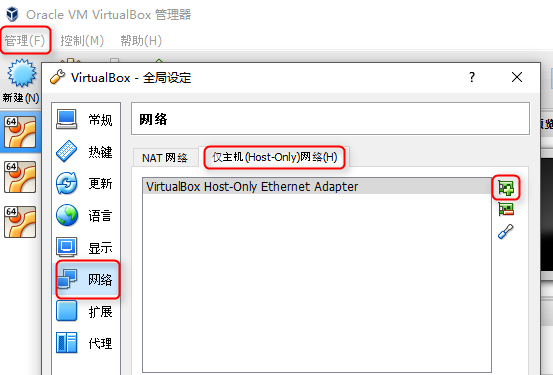
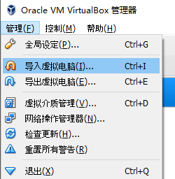
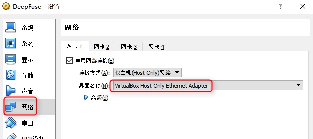
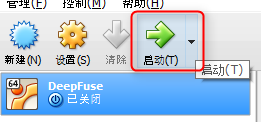

### 下载

首先下载**VirtualBox安装文件** ：[Windows版](http://download.virtualbox.org/virtualbox/5.1.6/VirtualBox-5.1.6-110634-Win.exe)，[OSX版](http://download.virtualbox.org/virtualbox/5.1.6/VirtualBox-5.1.6-110634-OSX.dmg)

还需要下载预安装Ubuntu的**VirtualBox镜像文件** ：[百度网盘](https://pan.baidu.com/s/1mhH0zAK)

### 安装VirtualBox

运行VirtualBox-5.1.6-110634-Win.exe之后一路点next就可以了。

安装以后，如果有需要，可以切换到中文

菜单 File - Preferences

选择Language

**创建一个虚拟本地网络**

菜单选择 管理 - 全局设定 - 网络 - 仅主机网络 - 添加一个新的网络

管理，**导入虚拟电脑**

选中DeepFuse.ova文件，生成一个新的虚拟机

右键进入设置，**改一下cpu和内存**，给虚拟机的cpu越多越好

再到网页设置里选中刚才创建的网络

随后**启动虚拟机**

启动后不需要任何干预，虚拟机会自动登陆并启动深度熔合服务器

接下来就可以[使用网页界面生成图像](use.html)了