如果是操作系统是最新版的Windows10，推荐使用[Windows10自带的Linux子系统](winbash.html)

对于其他用户，推荐按照以下流程通过VirtualBox虚拟机安装Ubuntu

### 下载

首先下载VirtualBox安装文件

Windows系统
[http://download.virtualbox.org/virtualbox/5.1.6/VirtualBox-5.1.6-110634-Win.exe](http://download.virtualbox.org/virtualbox/5.1.6/VirtualBox-5.1.6-110634-Win.exe)

[Mac版VirtualBox下载](http://download.virtualbox.org/virtualbox/5.1.6/VirtualBox-5.1.6-110634-OSX.dmg)

还需要下载Ubuntu的镜像文件，ubuntu 12之后的任何版本应该都可以，下面是ubuntu14.04的BT下载链接

[http://releases.ubuntu.com/14.04/ubuntu-14.04.5-desktop-amd64.iso.torrent](http://releases.ubuntu.com/14.04/ubuntu-14.04.5-desktop-amd64.iso.torrent)

### 安装VirtualBox

运行VirtualBox-5.1.6-110634-Win.exe之后一路点next就可以了。

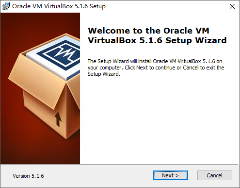

安装以后，如果有需要，可以切换到中文

菜单 File - Preferences

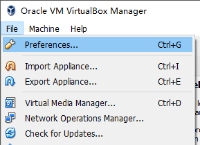

选择Language

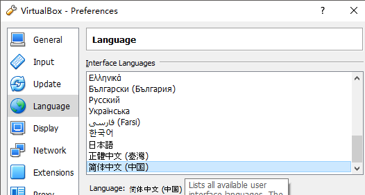

### 创建Ubuntu虚拟机

点击蓝色的`新建`按钮

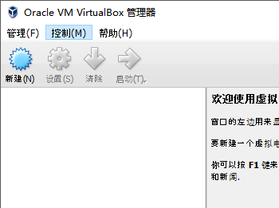

给你的ubunutu虚拟机命名

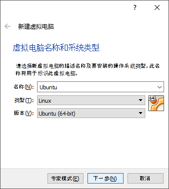

分配内存，取决于要处理的图有多大，先分windows内存的一半吧

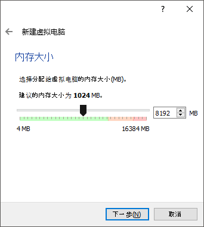

创建硬盘，至少8G以上

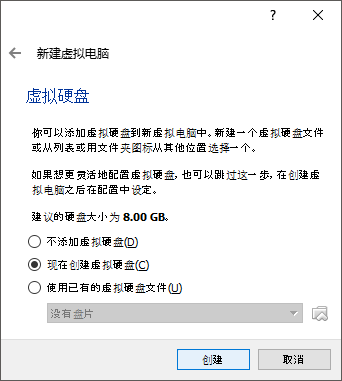

选固定大小可以加快安装系统的速度

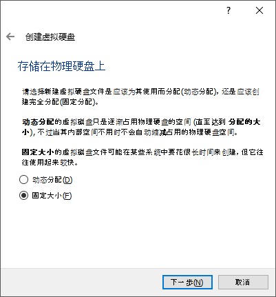

创建完镜像之后，右键点击Ubuntu镜像，进入设置

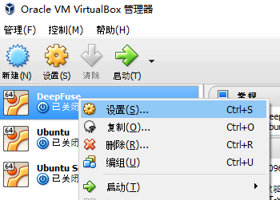

在存储这栏里，点击光驱的图标，选择`ubuntu-14.04.5-desktop-amd64.iso`镜像文件

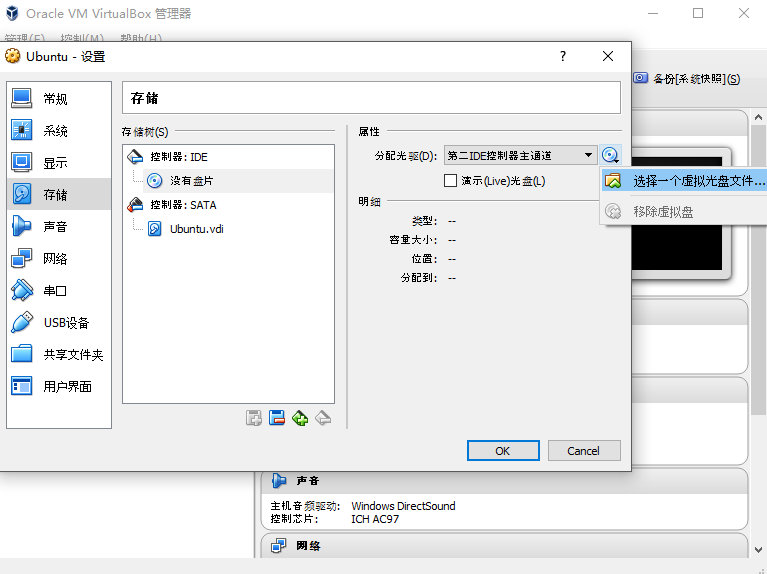

再到系统这栏增加一点处理器，处理器的多少直接决定了合成图像的速度

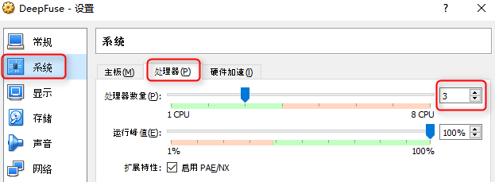

### 安装Ubuntu

退出设置后，点击绿色的`启动`箭头就可以进入Ubunut的安装过程

进入启动界面后，第一步可以先选择安装语言。虽然之后的教程都用中文版Ubuntu，但如果能看懂的建议还是安装英文版。

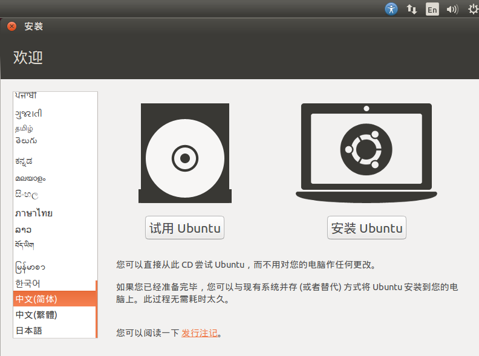

一路按照默认选项安装就可以

安装类型选择`清除整个磁盘并安装Ubuntu`，这里清除的是你创建的虚拟硬盘，所以不用担心

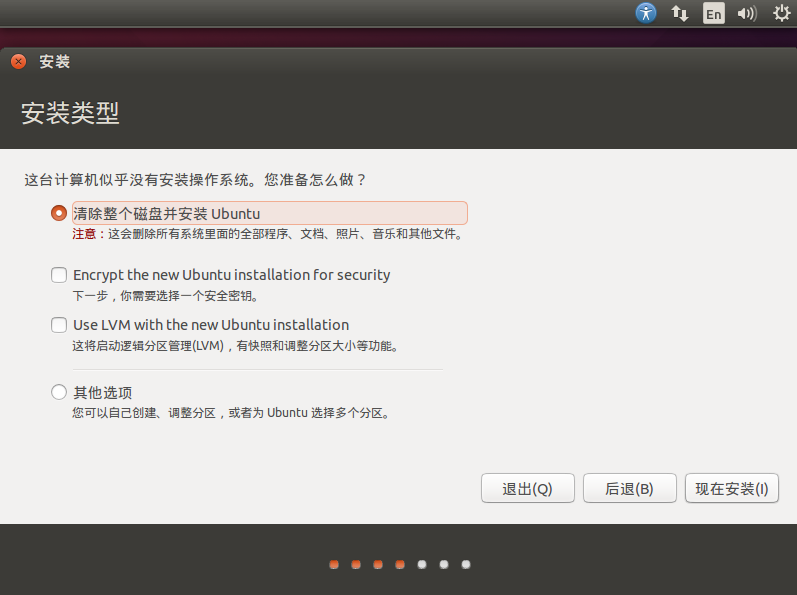

创建用户名密码，用户名最好是全英文的，这里我用了nsuser，另外千万别忘了自己设的密码

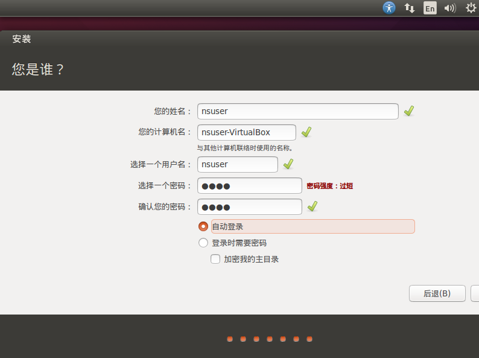

### 配置Ubuntu

安装完应该会自动进入Ubuntu系统

如果安装的是14.04，系统可能会提示你要不要升级到16.04，先选择不升级。

VirtualBox顶部菜单 设备-安装增强功能

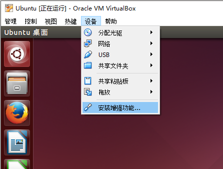

运行，输入管理员密码

运行结束后，命令行终端显示`Press Return to close this window`。按下回车关闭窗口就可以了

VirtualBox顶部菜单 设备-共享剪贴板 设置为`双向`

VirtualBox顶部菜单 设备-拖放 设置为`双向`

配置完这两项，就可以在windows和ubunutu之间拖放文件和共享剪贴板了

为了保证这些配置都生效，在Ubuntu内右上角点关机按钮，关机 - 重新启动

### 打开终端 开始安装

点击Ubuntu左上的第一个图标搜索Ubuntu，输入 `terminal`

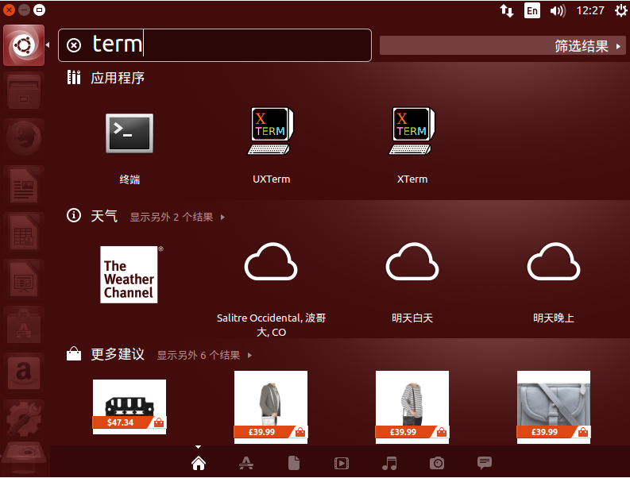

打开终端后，就可以进入下一步开始[深度熔合的安装了](install.html)
