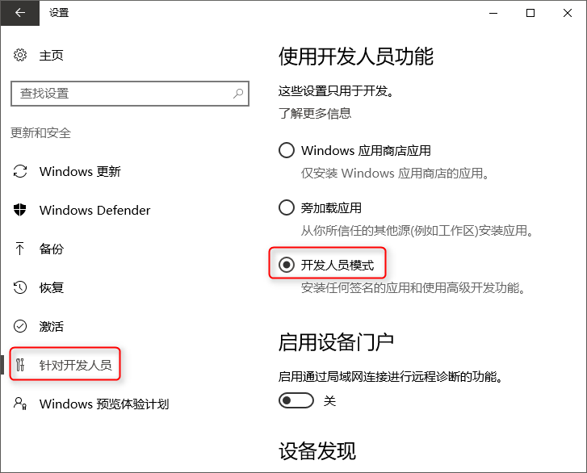
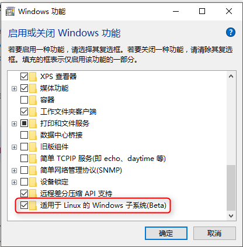
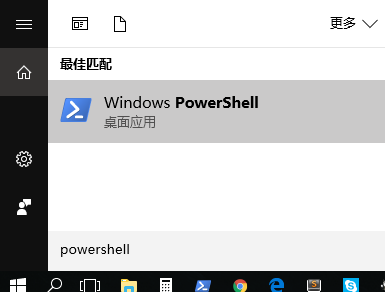
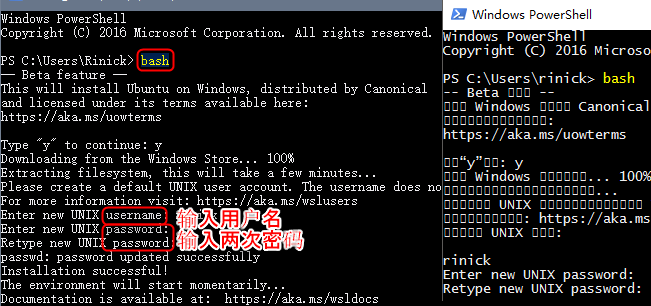

通过以下步骤来安装Windows 10的Linux子系统。完成以后就会有一个兼容Ubuntu的Bash终端。

本页教程**<span style="color:red">只适用于最新版的Windows 10</span>**<br>
老版Windows或OSX系统可以下载[预装深度熔合的VirtualBox镜像](virtualbox.html)

### 启用Linux子系统

在Windows设置里，进入`更新和安全`，开启`开发人员模式`



在 控制面板 - 程序和功能 里，开启`Linux子系统`



重启后，开启powershell终端，在终端里输入“bash”回车



第一次打开Bash会提示要不要下载安装Ubuntu，键入`y`回车就会开始下载<br>
下载完成后需要几分钟时间解压，解压完以提示新建linux用户名，再输入两次密码<br>
如果是中文系统的话这里可能会出现乱码，但不影响之后的使用




### 安装深度熔合

接着逐行复制以下命令到bash终端，整个过程需要下载1GB以上的数据

运行的过程中有几处会提示输入密码

```
cd ~

sudo apt-get update; sudo apt-get -y upgrade; sudo apt-get -y install build-essential git cmake libprotobuf-dev protobuf-compiler curl libreadline-dev

curl -s https://raw.githubusercontent.com/rinick/deep-fuse/master/install_torch.sh | bash

source ~/.bashrc

curl -s https://raw.githubusercontent.com/rinick/deep-fuse/master/install_win_bash.sh | bash
```

熟悉Linux的用户也可以[自行安装需要的模块](install.html)

### 运行

在bash终端输入

```
cd ~/deep-fuse
sh run.sh
```


### 已知问题

由于[这个Windows的Bug](https://github.com/Microsoft/BashOnWindows/issues/616)，上传图像可能会卡住。暂时只能等微软的补丁来修复这些问题。

如果点击开始合成之后，超过30秒页面都没有更新，可以进入命令行`Ctrl+C`终止任务，在重新`sh run.sh`运行

<!--
### 其他

所有linux子系统的文件都位于这个windows隐藏目录下`%localappdata%\Lxss`，可以用资源管理器从这里把文件拷贝出来，但如果用资源管理器向这里写入文件可能会和linux的权限配置有冲突。

反过来，在linux子系统下，可以在`/mnt/`找到所有windows文件
-->


