Apophysis是一个免费的“分形火焰”生成软件。 
这篇教程的目的是帮助初学者学会使用Apophysis，而并不是要告诉你分形是怎么回事或者分形火焰的生成机制。

以下教程基于老版Apophysis，新版使用方法基本相同

新版Apophysis 官方网站：[apophysis-7x.org](http://apophysis-7x.org/) 
[下载](http://apophysis-7x.org/download)

老版Apophysis 官方网站：http://www.apophysis.org/   

建议先下载安装程序，再来看这篇教程

运行Apophysis后，程序主窗口左侧会生成一系列随机的分形图案，点击列表中内容就能逐个看这些分形的效果。 
下文称这些分形效果为“火焰”。

这些随机生成的“分形火焰”一般不会给人太多惊喜。要利用Apophysis提供的其他工具才能得到我们想要的绚丽图像。

改变窗口大小，或者把窗口最大化，都会影响预览图的大小。要注意的是：预览图越大，计算时间也就越长。推荐还是不要把窗口拉得太大。

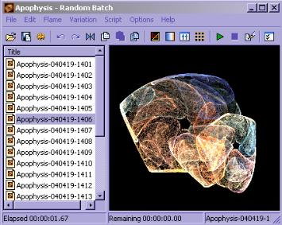

提示： 
默认状态下的预览图显得很粗糙 
菜单中选择 Options － Options － Display 可用来调节预览图。 
Quality默认是5，如果你把它加到10会明显提高预览质量，但也会让计算时间加倍。Quality越高速度越慢质量越好，但这只会改变预览效果和预览速度，并不影响最后导出的图。

点击预览图上方的“变异”按钮。会弹出包含9个分形效果的窗口供你选择火焰。中间的是你当前的火焰，而周围的8个则是根据当前火焰而产生的“变异”版本。 
点击中间的火焰，会根据当前火焰重新生成8个变异版本。而点击周围的某个火焰就意味这用它来代替当前火焰，并且基于新的火焰重新生成8个变异版本。

窗口中Speed指的是变异速度，数值越小则变异火焰和原来的火焰越相似

窗口中Trend下拉菜单用来修改变化趋势，你可以尝试一下选不同的趋势来观察每种趋势带来的变异效果。

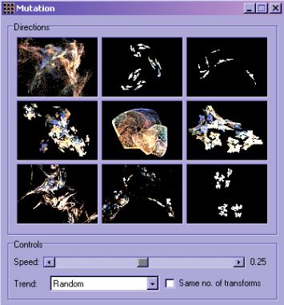

点击预览窗口上的“编辑”按钮 。 
弹出的窗口里每个三角形代表了火焰中不同的元素。点击某个三角就可以拖动它，拖动的同时，编辑窗口的火焰图案也在实时地变化，鼠标松开后，预览窗口里的内容也会相应地改变。 
你还可以通过拖动三角行的顶点来改变其形状，或者拖动三角形的边来旋转它。右键点击三角形，你还能看到add（添加新的三角形），delete（删除），flip（翻转）等等操作。 
慢慢尝试，很快你会明白这些元素是如何对火焰的形状造成影响的。

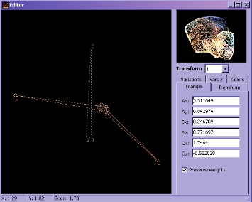

另一个改变火焰形状的方法是使用脚本 
菜单中选择 scripts - open打开一个asc文件。 
然后点击主窗口上的播放按钮来运行脚本 
我想初级使用者不太需要这项功能，这里就不多啰唆了，以后也许会写一个专门的脚本教程 
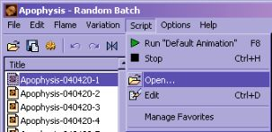 
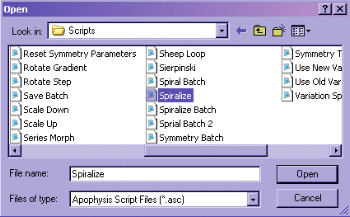

调节配色方案也是创作火焰的乐趣之一。换一种颜色渐变，火焰的视觉效果就会完全不同。 
在主窗口中点击渐变色按钮，打开配色对话框。 
点击配色条右边的箭头，弹出下菜单中会显示预设的各种配色方案。改变配色就能马上在预览窗口中看到新的火焰效果

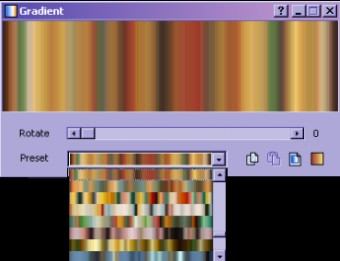

配色对话框的另一个功能是滚动颜色。拖动Rotate滚动条就能使颜色渐变循环平移。通过这个功能，我们只用一个颜色渐变就能得到千变万化的火焰效果。

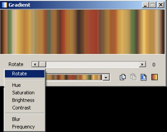

也许你电脑上有些不错的图，Apophysis允许你直接用图里的颜色来给你的火焰上色。 
在配色对话框里点击“Smooth Palette”按钮，点“open”打开一张图片，Apophysis会根据图片计算出一个配色并且把它反映到火焰上。

 
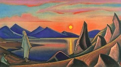 
某张喜欢的图 
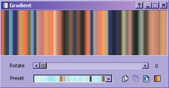 
从图中计算出来的颜色渐变

如果你得到一个喜欢的配色，可以右键点击配色条，选择“save gradient”把配色方案保存下来。保存时会有2行要填写，第一行是选取保存的文件。第二行则是给你的配色取个名字。 
Apophysis中的配色方案不是一个个分开存的，而是把很多套配色存在同一个文件里。所以你可以选择一个已经存在ugr文件，把配色添加进去。或者存到一个新的ugr文件，那么这个文件里就只有一套配色方案。 
以后，当你需要这个配色方案的时候，点击“Gradient Browser”按钮，然后点击文件夹形状的按钮打开你先前保存的ugr文件，在随后显示出来的一些配色列中找到你需要的那个。

 
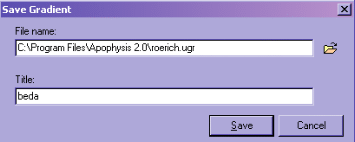

如果需要改变火焰的背景色，在主窗口中点击“调节”按钮。在background的位置可以改变背景色。 
Camera面板里的的拖动条允许你对火焰进行移动缩小放大等操作。

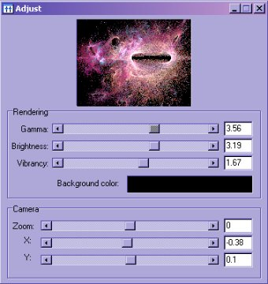

如果你得到了一个你很喜欢的火焰，那你一定希望把它保存下来。 
这里所指的是保存火焰的参数，而不是保存图片，因为只有这样才能下次打开并修改它。

选择菜单中的 File - Save Parameters 来保存火焰， 
图中作者给他的火焰文件取名为&quot;space_flames.flame&quot;，而在Title对话框，则命名为&quot;Chaos&quot;。 
这是因为一个火焰文件也是可以同时包含多个火焰的，所以文件名并不能代表火焰的名字，title里的chaos才是。

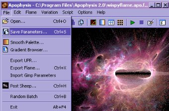 
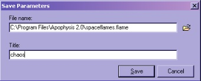

以后如果你需要打开火焰进行进一步操作。 
就在菜单中选择 File - Open 
此时左侧的火焰一览将不再是随机的火焰，而是文件中所保存着的火焰。

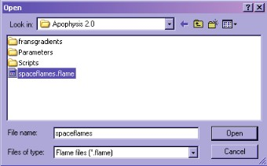 
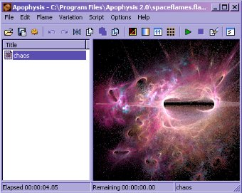

最后的步骤，就是把设计好的火焰导出成绚丽的图片了 
点击主窗口上齿轮形的按钮 
输入你想要的宽高，尺寸越大渲染的时间越长。 
按下"render"按钮开始渲染火焰，

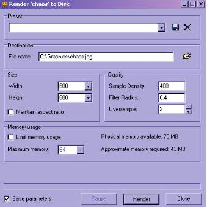

提示，如果你需要导出一个透明背景的火焰，把导出文件后缀改成png就行了。

 
如果渲染功能弹出错误警告，那你也许需要更新你的渲染工具 
在Apophysis菜单中选择Options - options -paths 
把最后一项的路径(export renderer)，指向Apophysis安装目录，选择hqi.exe。

以上内容部分翻译自 http://www.arcanefractals.com/ (原站链接已失效)
