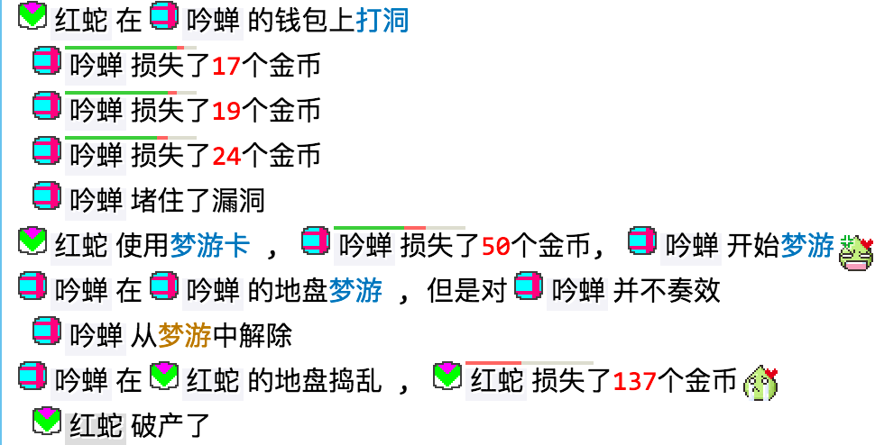
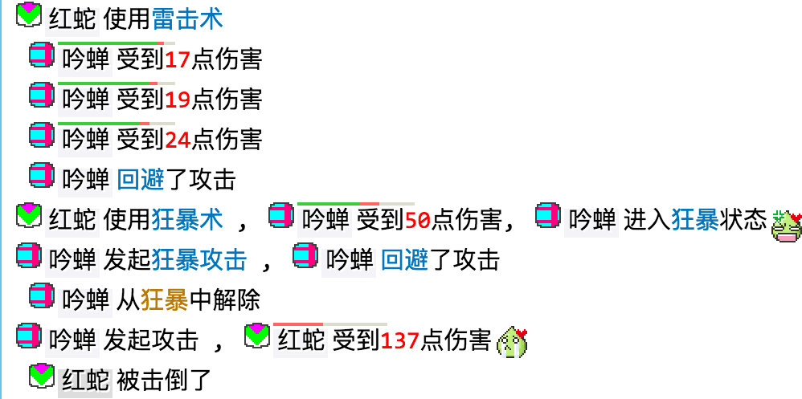

名字竞技场默认语言是中文。但是可以自己设定文字，使用其他语言，甚至可以完全改变游戏显示的内容。

#### 改变语言：

* 英文版：[/?l=lang%2Fen.json](https://deepmess.com/namerena/?l=lang%2Fen.json)
* 繁体中文：[/?l=lang%2Fzh-TW.json](https://deepmess.com/namerena/?l=lang%2Fzh-TW.json)

#### 改变内容：

* 大富翁：[/#l=lang%2zh-money.json](https://deepmess.com/namerena/?l=lang%2Fzh-money.json)  
用金币代替生命值，如果不喜欢打打杀杀，推荐试一下大富翁语言包。

##### 大富翁语言包 战斗过程示例

##### 对比普通版

### 创建自己的语言包

* 首先下载默认的语言文件：<a href='https://deepmess.com/namerena/lang/zh.json' download>/lang/zh.json</a>
* 用UTF8编码打开语言文件，编辑语言，再以UTF8保存。
* 上传语言文件到某个网站，请确保该网站返回正确的 <a href="https://en.wikipedia.org/wiki/Cross-origin_resource_sharing">CORS头文件</a>
  * 如果没有自己网站，可以到 <a href="https://pages.github.com/" target="_blank">Github Page</a> 免费建站
* 把json文件的网址输入下面的输入框，点击 <button onclick="openUrl()">生成链接</button>

<input style="width:100%" id="urlinput"/>
