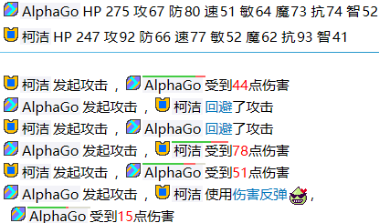

**名字竞技场** 是一款基于文本的对战游戏。是十年前Flash游戏 **MD5大作战** 的续作。 

游戏地址： [//ulugo.com/namerena](//ulugo.com/namerena)

玩法：在文本框中输入几个名字点击开始就可以进入战斗，之后不需要任何操作，战斗的过程和结果由输入的名字直接决定。每次输入相同的名字都会得到相同结果，即使改变名字的顺序结果也不会变。

	

### 属性和技能

同一个名字在不同的战斗中会以相同的属性出现，掌握的技能也一样。

要在对战中取胜，关键是要找到一个足够强大的名字。

了解更多：

* [属性说明](./attribute.html)
* [技能列表](./skill.html)
* [命名规则](./naming.html)
* [特殊名字](./special.html)
* [测号技巧](./testing.html)

### 组队战

通常情况下每行输入一个名字，所有名字进行混战。

但如果在名字中加入空行，则会以空行分隔进行分组队战。

### 其他文档

* [如何把名字竞技场嵌入自己的应用](./api.html)
* [如何使用自定义的语言包](./custom_lan.html)

### 社区

* [论坛](https://namerena.flarum.cloud/)
* [百度贴吧](http://tieba.baidu.com/%E5%90%8D%E5%AD%97%E7%AB%9E%E6%8A%80%E5%9C%BA)
* QQ群 ： 1079992837
