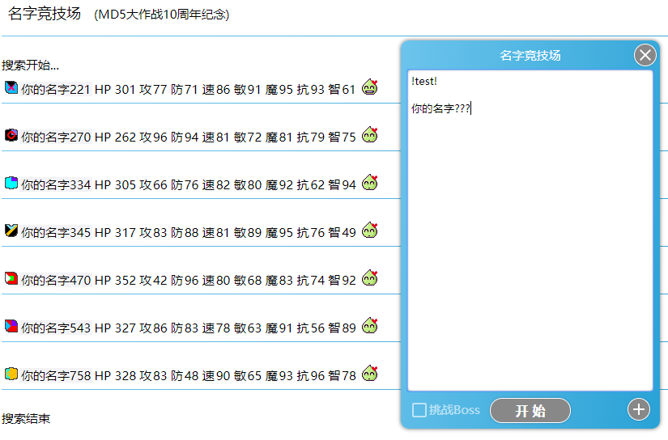

名字竞技场中取胜的关键是找到强大的名字。

### 基本测号技巧

* 使用快捷键
  * Alt 1 : 开始战斗
  * Alt 2 : 返回输入界面
* 测名字的时候不用关注数值，直接看属性之后的绿色表情。 
  数值足够高的名字在详细属性之后会带有一个表情，没有特殊表情的名字基本可以无视。
* 每项数值都很重要。 
  人物属性数值每一项都有相似的重要性，不要轻视任何一个数值。

### 搜索带表情的名字

使用方法：

 * 在战斗输入框的第一行输入 : `!test!`
 * 第二行留空
 * 第三行输入 : `任意名字???`
   * 搜索名字时会自动将名字替换成000~999的数字
 * 如果不喜欢数字后缀，也可以不使用问号，在第三行开始每行输入一个想搜索的名字，最少10个，最多8000个
 * 点击**开始** 启动名字搜索

### 保留自己喜欢的名字或徽章

##### 保留名字

每个名字有对应的属性，如果有一个喜欢的名字不想改，但又希望能得到更强的实力，可以借助系统自动简化名字的功能。

* 战斗过程中不显示战队名称，因此可以随意改变名字后的战队来得到不同的数值。
* 名字中如果有空格，空格后的内容在战斗中也不显示，也可以随意改变来得到不同的数值。

以下4个名字在战斗中都会显示为 Rick

*  Rick
*  Rick Zhou
*  Rick@中国
*  Rick Zhou@中国

##### 保留徽章

如果找到一个名字又你喜欢的徽章，例如 中国，但又想得到更强的实力。 
这种情况下可以直接把名字当成战队使用来保留徽章。

比如：

*  中国
*  中国 加油@中国
*  青松@中国

### 实力评估

实力评估可以精确测试一个名字是否强大。

使用方法：

 * 在战斗输入框的第一行输入 : `!test!`
 * 在战斗输入框的第二行输入需要测试的名字。
 * 点击 **开始** 启动实力评估

测试结果会输出名字的详细评分，得分范围 0 ~ 10000 分

* 0% ~ 10%，快速得出一个粗略评分
* 11% ~ 100%，得出一个较为精确的评分。
* 101% ~ ???，为满足强迫症患者，提供更精确的评分。

* 得分5000以上即为较强的名字。
* 7000是普通名字的得分极限，超过7000分的强号极其罕见。
* 内置的boss得分都在9900以上。
